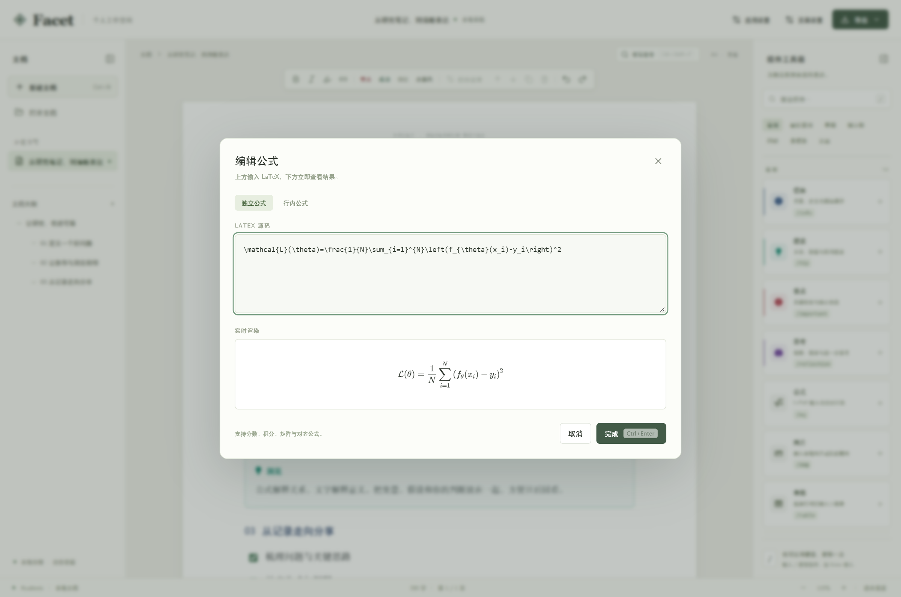
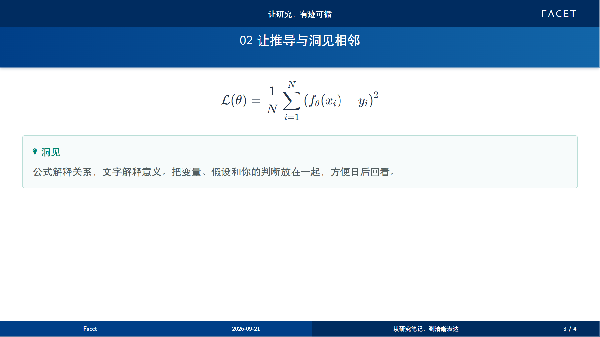

<div align="center">
  
  <h1>Facet</h1>
  <p><strong>一份内容，从研究笔记到演示分享。</strong></p>
  <p>One source, many facets.</p>
  <p>本地优先的研究写作桌面应用，把分页书写、科研组件与演示导出放进同一个工作空间。</p>
  <p>
    <a href="https://github.com/YangAtlas/Facet/releases/latest"><strong>下载 Facet</strong></a> ·
    <a href="#开始书写">开始书写</a> ·
    <a href="#一份内容多种交付">查看导出</a> ·
    <a href="https://github.com/YangAtlas/Facet/issues">反馈问题</a>
  </p>
  <p>
    
    <a href="LICENSE"></a>
  </p>
</div>


<p align="center"><sub>在纸面上展开思考，用组件组织证据。截图来自实际运行的 Facet，内容为可编辑的写作示例。</sub></p>

## 为研究与表达而写

从阅读笔记、方法推导到组会分享，Facet 让完整的思考留在同一份文档中。正文按纸面分页；分享时，三级标题会成为演示页的主题，长内容自动续页。

| 写作中需要什么 | Facet 如何帮你完成 |
| --- | --- |
| 一眼看清文章结构 | Part、三级标题、可跳转大纲与自动目录 |
| 把观点与证据放在一起 | 问题、定义、洞见、实验、结果、结论等科研卡片 |
| 写下公式与技术细节 | LaTeX 公式实时预览；代码块支持语言选择、行号与语法高亮 |
| 安排图文与结果 | 图片题注、子图、可调比例双栏、三线表与网格表 |
| 让内容适合不同场景 | A4 竖版、16:9 横版；纸面 PDF、Beamer PDF 与 LaTeX 源码包 |
| 自己掌握文件 | `.facet` 文件保存文字、结构和图片，本机草稿支持恢复 |

## 下载与安装

在 [最新版本](https://github.com/YangAtlas/Facet/releases/latest) 中选择与你的电脑对应的文件。

| 平台 | 下载 | 安装方式 |
| --- | --- | --- |
| Windows 10 / 11 · x64 | [安装版 `.exe`](https://github.com/YangAtlas/Facet/releases/download/v0.1.0/Facet-0.1.0-win-x64-setup.exe) | 运行安装向导，可选择安装目录 |
| Windows 10 / 11 · x64 | [便携版 `.exe`](https://github.com/YangAtlas/Facet/releases/download/v0.1.0/Facet-0.1.0-win-x64-portable.exe) | 直接运行 |
| macOS · Apple 芯片 | [Apple 芯片版 `.dmg`](https://github.com/YangAtlas/Facet/releases/download/v0.1.0/Facet-0.1.0-mac-arm64.dmg) | 打开后将 Facet 拖入 Applications |
| macOS · Intel | [Intel 版 `.dmg`](https://github.com/YangAtlas/Facet/releases/download/v0.1.0/Facet-0.1.0-mac-x64.dmg) | 打开后将 Facet 拖入 Applications |

macOS 同时提供 ZIP 包，可在版本页面下载。首次运行的系统提示见下方[使用说明](#使用说明)。

## 开始书写

1. **新建文档。** 选择 A4 竖版或 16:9 横版，在「页面设置」中填写标题、作者、封面和主题色。
2. **搭好结构。** 用一级、二级标题组织章节，用三级标题划分将来分享时的主题。左侧大纲随内容更新。
3. **插入组件。** 点击右侧组件卡片，或在新段落输入 `/` 搜索。试试 `/eq` 公式、`/insight` 洞见、`/table` 表格和 `/code` 代码。
4. **保存与分享。** 按 `Ctrl+S`（Windows）或 `⌘S`（macOS）保存 `.facet`；通过右上角「导出」生成 PDF 或 LaTeX 源码包。

### 公式，让推导随手可写

输入 LaTeX，立即查看排版效果。行内公式与独立公式都能在编辑后继续修改。



### 一份内容，多种交付

| 导出格式 | 适合的场景 | 输出方式 |
| --- | --- | --- |
| **纸面 PDF** | 阅读、归档、打印 | 保留编辑器中的分页、页眉页脚和组件样式 |
| **Beamer PDF** | 组会、课程、研究分享 | 16:9 横版；按三级标题分帧；长内容自动续页；Part 独立成页 |
| **LaTeX 源码包** | 进一步排版与定制 | 包含源码和资源，可使用 XeLaTeX 编译 |


<p align="center"><sub>在导出设置中选择格式，并为演示配置标志、封面与页码。</sub></p>



<p align="center"><sub>由上方示例笔记实际生成的 16:9 演示页。</sub></p>

## 使用说明

- 当前安装包未进行 Apple Developer ID 签名、公证或 Windows 代码签名。macOS 如阻止打开，可在「系统设置 → 隐私与安全性」中查看该应用的「仍要打开」选项；Windows 如出现 SmartScreen 提示，确认文件来自本仓库的 Release 后，再选择「更多信息 → 仍要运行」。
- 桌面版生成纸面 PDF 和 Beamer PDF 使用内置排版能力。编译导出的 LaTeX 源码包需要另行安装支持 XeLaTeX 的 TeX 环境；其分页与组件外观采用独立排版。
- 超宽公式或超高的单个表格行可能需要手动拆分。导出前检查排版提示。
- Windows 打开已有文档时，请在应用内选择「打开文档」；本版本的文件关联尚未处理双击 `.facet` 时传入的文件路径。
- 工作文件保存在本机。建议定期保存 `.facet`，并将重要文档纳入自己的备份流程。便携版运行时也会在本机保存偏好与恢复草稿。

## 本地开发

需要 **Node.js 22.12+** 与 **pnpm 11.19.0**。

```bash
git clone https://github.com/YangAtlas/Facet.git
cd Facet
pnpm install --frozen-lockfile
pnpm dev
```

在浏览器打开开发服务器。运行桌面版前先构建前端：

```bash
pnpm build
pnpm desktop
```

运行项目检查：

```bash
pnpm test
pnpm exec playwright install chromium
pnpm test:e2e
pnpm build
```

端到端测试会自动启动开发服务器。也可以通过 `PLAYWRIGHT_CHROMIUM_PATH` 指定本机 Chrome 路径。

### 构建安装包

在相应系统中执行：

```bash
pnpm dist:win    # Windows：x64 安装版与便携版
pnpm dist:mac    # macOS：Apple 芯片与 Intel 的 DMG、ZIP
```

产物位于 `release/`。GitHub Actions 在推送 `v*` 标签时分别构建 Windows、Apple 芯片 Mac 和 Intel Mac；全部测试和构建成功后，将安装包发布到对应 Release。手动运行工作流仅构建并保存产物。

README 截图可在开发服务器运行后，通过 `node scripts/capture-screenshots.mjs` 重新生成。

## 许可证与致谢

Facet 使用 [MIT 许可证](LICENSE)。内置字体与素材分别遵循 [Fandol 字体许可](src/assets/FANDOL-LICENSE.txt)、[浙江大学字标使用说明](src/assets/ZJU-ATTRIBUTION.md) 和 [TeX 模板许可](Tex-Template/LICENSE)。
